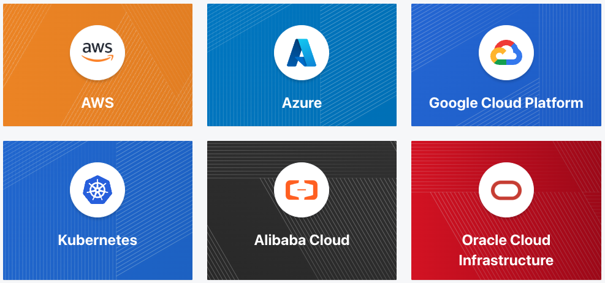
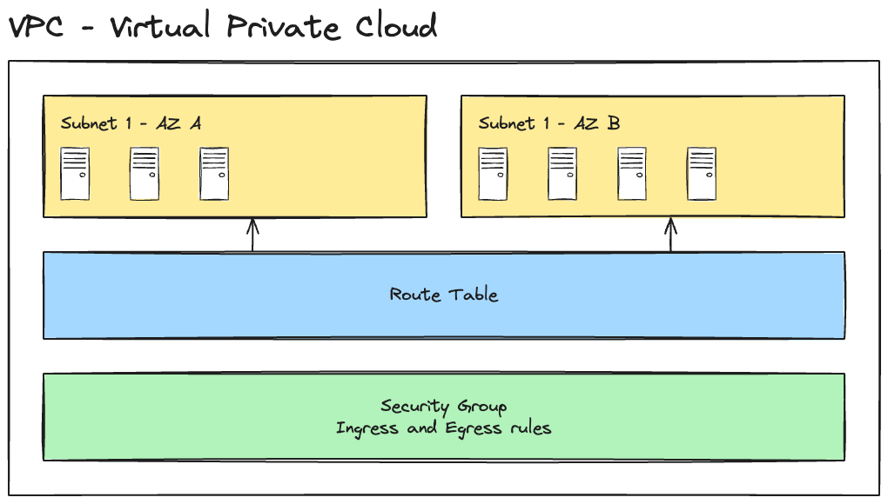

# Terraform

[Terraform](https://www.terraform.io/) is an open-source infrastructure as code software tool created by [HashiCorp](https://www.hashicorp.com/) that enables users to define and provision infrastructure using a declarative configuration language. With Terraform, users can describe the desired state of their infrastructure in configuration files, specifying resources such as virtual machines, networks, and storage, and then Terraform automates the process of creating, updating, and managing these resources across various cloud providers and on-premises environments. This approach allows for consistent and repeatable infrastructure deployments, simplifying the management of complex systems and facilitating infrastructure automation.

## Idempotence

One of the key benefits of Terraform is its support for idempotent operations. An operation is considered idempotent if the result of performing it multiple times is the same as performing it once. In the context of Terraform, this means that applying the same configuration multiple times will not result in any changes to the infrastructure if the desired state is already achieved. This property is essential for ensuring the predictability and reliability of infrastructure deployments, as it allows users to safely reapply configurations without causing unintended side effects or disruptions.

Terraform does this by maintaining a state file that tracks the current state of the infrastructure and the desired state defined in the configuration files. When applying a configuration, Terraform compares both and determines the necessary actions to bring the infrastructure into the desired state, that way accurately determining which resources need to be created, updated, or deleted to achieve the desired configuration.

## Terraform vs Ansible

While Terraform and [Ansible](https://www.ansible.com/) are both popular tools for automating infrastructure management, they serve different purposes and are often used together in complementary ways. Terraform is primarily focused on defining and provisioning infrastructure resources, such as virtual machines, networks, and storage, using a declarative configuration language. In contrast, Ansible is a configuration management tool that is designed to automate the installation and configuration of software on existing servers.

## Providers

Providers are a logical abstraction of an upstream API. They are responsible for understanding API interactions and exposing resources. The available providers can be found on https://registry.terraform.io/browse/providers. Some of them are created by Hashicorp and others by the community and partners.



## Hashicorp Configuration Language (HCL)

The HashiCorp Configuration Language (HCL) is a configuration language authored by HashiCorp. Although intended to be generally useful, it is primarily targeted towards devops tools, servers, etc. HCL provides a set of constructs that can be used by a calling application to construct a configuration language. The application defines which attribute names and nested block types are expected, and HCL parses the configuration file, verifies that it conforms to the expected structure, and returns high-level objects that the application can use for further processing.

💡 More information about it can be found on https://github.com/hashicorp/hcl

## Basic commands

- `terraform init`: Prepare your working directory for other commands
- `terraform plan`: Show changes required by the current configuration
- `terraform apply`: Create or update infrastructure

## Variables

Variables can be created using the `variable` keyword, and within the module that declared it, its value can be accessed from within expressions as `var.<NAME>`, where `<NAME>` matches the label given in the declaration block.

Variables can be set through several different ways:

- In a Terraform workspace
- Using the the `-var` option on the CLI
- In `.tfvars` files, either specified on the CLI or automatically loaded.
- As environment variables

## Outputs

Output values make information about your infrastructure available on the command line, and can expose information for other Terraform configurations to use. Output values are similar to return values in programming languages and can be defined using the `output` keyword.

```tf
output "file_id" {
  value = resource.local_file.example.id
}
```

If you want to learn more about outputs you can refer to https://developer.hashicorp.com/terraform/language/values/outputs

## Data Sources

Data sources allow Terraform to use information defined outside of Terraform, defined by another separate Terraform configuration, or modified by functions. It basically functions as a bridge between Terraform configurations and existing resources outside of Terraform's control, allowing Terraform to make informed decisions or establish relationships between resources.

Data sources can be defined using the `data` keyword.

```tf
data "local_file" "example_content" {
  filename = "example.txt"
}
```

If you want to learn more about data sources you can refer to https://developer.hashicorp.com/terraform/language/data-sources

## Repository content

The Terraform files provided in this repository enable you to replicate the following architecture on AWS: two subnets, each located in a distinct availability zone, along with a route table and a security group designed for managing both Ingress and Egress traffic.



## Running locally

1. Create an AWS Account if you don't have one
1. Create an user with _AdministratorAccess_ permission
1. Install the aws cli
1. Run `aws configure`
1. Provide the public and private access keys
